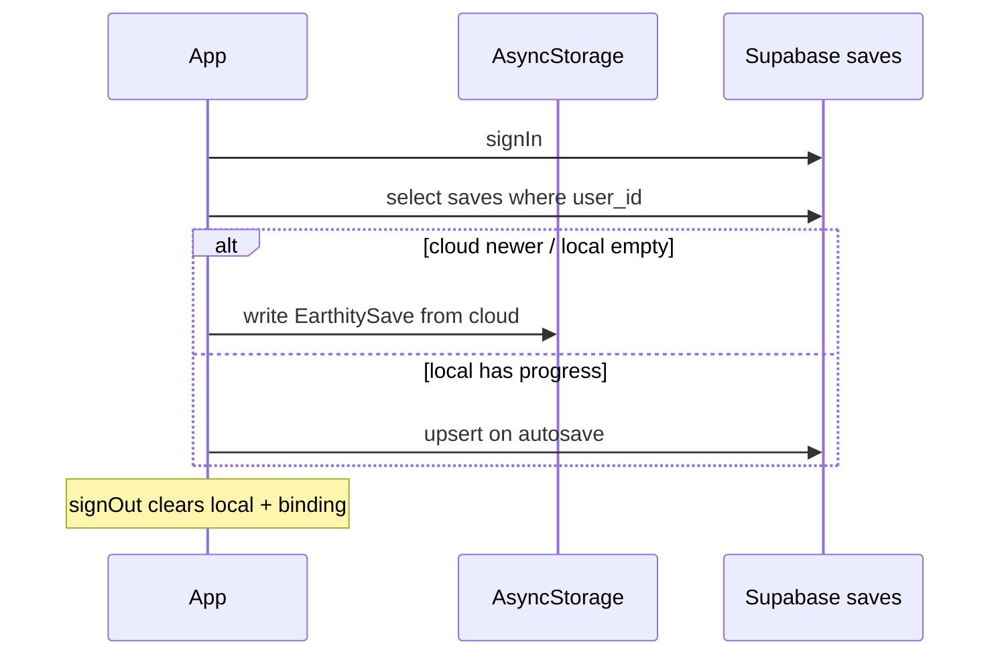
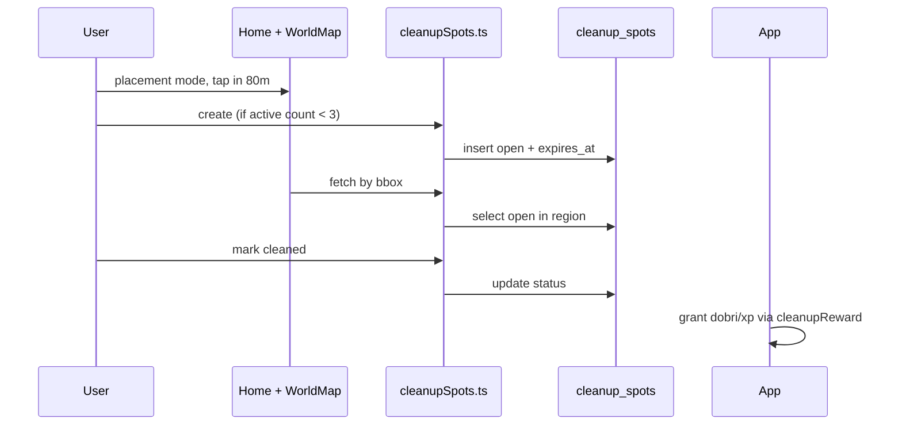

# Earthity — архитектура

Технический обзор для разработчиков. Продуктовый контекст: [PRODUCT.md](./PRODUCT.md).

---

## Стек

| Слой | Технология |
|------|------------|
| Клиент | React Native 19, Expo ~54, Expo Router 6 |
| Язык | TypeScript |
| Карта | `react-native-maps`, `expo-location` |
| 3D | `expo-three`, `@react-three/fiber`, `@react-three/drei` |
| Локальное хранилище | `@react-native-async-storage/async-storage` |
| Бэкенд | Supabase (Auth + Postgres + RLS) |
| Сессия | Supabase client с AsyncStorage (`lib/supabase/client.ts`) |

**Платформы:** Android (приоритет), Web (отладка карты), iOS — позже.  
**Сборка:** Managed Expo; `android/` / `ios/` по prebuild при необходимости.

---

## Структура репозитория

```
app/                    # Экраны (file-based routing)
  (auth)/login.tsx      # Вход / регистрация
  (app)/(tabs)/         # Основное приложение
    index.tsx           # Home (карта, квесты, существо)
    profile.tsx
    inventory.tsx, craft.tsx, daily.tsx, diary.tsx
    achievements.tsx, stats.tsx, onboarding.tsx  # скрытые из таба
    three-test.tsx      # DEV 3D
components/
  home/                 # Home UI, карта, cleanup sheet
  map/                  # WorldMap, MapARScene
  three/                # Scene3D, Model
features/               # Доменная логика по фичам
  cleanupSpots/
  creatures/, quests/, dailyQuests/, crafting/, inventory/, ...
lib/
  auth/                 # AuthContext
  supabase/             # client, cloudSave, cleanupSpots
  storage/              # EarthitySave в AsyncStorage
  home/                 # Хуки оркестрации Home
  shared/               # game-engine, types, craft-engine
  i18n/
supabase/migrations/    # SQL для ручного Run в Supabase
assets/models/          # GLB (политика git — открытый вопрос)
docs/                   # Продукт, питч, бизнес, архитектура
```

---

## Навигация и auth gate

```
app/_layout.tsx
  └─ AuthProvider
       ├─ нет сессии → (auth)/login
       └─ есть сессия → (app)/(tabs)/...
            CloudSaveGate → reconcile cloud save
```

Файлы: `lib/auth/AuthContext.tsx`, `lib/supabase/cloudSave.ts`, `app/_layout.tsx`.

---

## Модель данных

### Локальный сейв — `EarthitySave`

Один JSON в AsyncStorage, тип в `lib/shared/types.ts`:

- Прогресс: `dobri`, `xp`, `deeds`, `completed` (квесты)
- Ресурсы: вода, корм, trash (plastic/glass/paper/bio)
- Аватар, имя, титулы, `careDiary`, `creatureMapSpawns`
- `dailyQuests`, `drops`, `crafted`, `resourceRespawnUntil`

Логика: `lib/shared/game-engine.ts`, `lib/storage/storage.ts`, `lib/storage/save.repository.ts`.

### Облако — `public.saves`

| Колонка | Назначение |
|---------|------------|
| `user_id` | PK, FK → auth.users |
| `data` | JSONB = EarthitySave |
| `save_version` | Версия схемы |
| `updated_at` | Для merge / отладки |

RLS: только свой `user_id`. См. [SUPABASE.md](./SUPABASE.md).

### Облако — `public.cleanup_spots`

Shared UGC на карте. Клиент: `lib/supabase/cleanupSpots.ts`, хук `lib/home/useCleanupSpotsMap.ts`.

| Поле / поведение | Смысл |
|------------------|--------|
| `status` | `open`, `in_raid`, `cleaned` |
| `expires_at` | TTL 7 дней |
| `latitude`, `longitude` | Позиция |
| `user_id` | автор метки |
| `cleaned_by` | кто отметил уборку |

RLS: автор удаляет свою; чужой — `mark_cleaned` → `cleaned`. Миграция **005** — SELECT для `cleaned_by`.

Награда при clean: `features/cleanupSpots/cleanupReward.ts` (синхрон с SQL `004`).

Release APK: без 3D на карте — см. [EAS_RELEASE_3D_ROLLBACK.md](./EAS_RELEASE_3D_ROLLBACK.md).

---

## Поток: вход и сейв



---

## Поток: метка мусора



---

## Home — оркестрация

`app/(app)/(tabs)/index.tsx` — точка сборки. Вынесено в хуки:

| Хук | Роль |
|-----|------|
| `useHomeScreenPersist` | load/focus, autosave |
| `useHomeSaveSync` | debounced cloud push |
| `useHomeMapLayerProps` | пропсы карты, спавны |
| `useCleanupSpotsMap` | метки, placement, rewards |
| `useHomeQuestFlow` | квесты |
| `useHomeCreatureCareActions` | уход за существом |
| `useDailyWalkTracking` | метры для daily |

Карта: `components/home/HomeScreenMapSection.tsx` → `HomeMapLayer` → `WorldMap` + `MapARScene`.

---

## i18n

- `lib/i18n/i18n.ts` — строки по языкам
- `lib/i18n/locale-strings.ts` — типы ключей
- `LanguageCode`: ru | de | uk | ar | en
- Проверка: `npm run i18n:check`

---

## Безопасность (текущее)

- Anon key в клиенте — норма для Expo; **обязателен RLS** на всех таблицах.
- Награда за cleanup считается на **клиенте** — риск читов до Edge Function (бэклог P4).
- Нет фото-доказательства уборки в MVP — см. фаза 2 roadmap.

---

## Известный техдолг

- Мёртвый REST: `lib/api/authLogin.ts`, `lib/api/client.ts`, `lib/auth/tokenStorage.ts`
- `stats` и `achievements` — скрыты из таббара, дубли с профилем
- ESLint warnings на R3F-компонентах (~38)
- GLB в git не решён
- Центр города — константа Berlin

---

## Связанные документы

- [SUPABASE.md](./SUPABASE.md) — миграции
- [ROADMAP.md](../ROADMAP.md) — фазы
- [EARTHTY-BACKLOG.md](../EARTHTY-BACKLOG.md) — задачи
